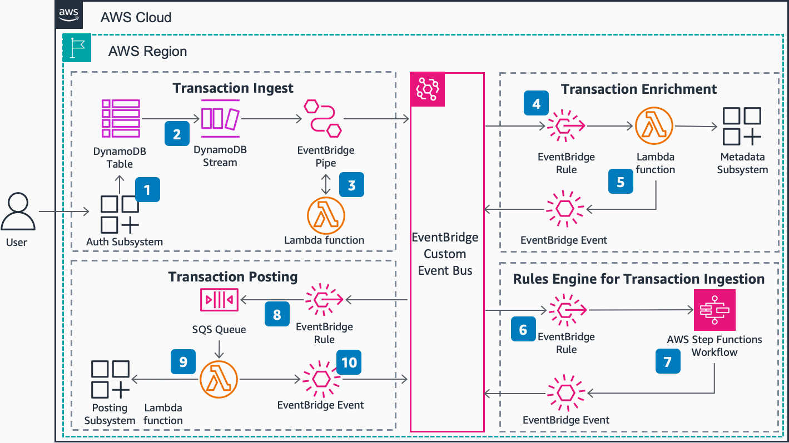

# Guidance for Building Payment Systems Using Event-Driven Architecture on AWS

This guidance focuses on payment processing subsystems responsible for posting payments to recieving accounts. In this phase of payment processing, inbound transactions are evaluated, have accounting rules applied to them, then are posted into receiving accounts. The accounting rules dictate the work that needs to happen to successfully process the transaction. Inbound transactions are assumed to have been authorized by an upstream process.

In traditional architectures, the upstream system writes transactions to a log. The log is periodically picked up by a batch-based processing system system, processed in bulk, then eventually posted to customer accounts. Transactions (and customers!) must wait for the next batch iteration before being processed, which can take multiple days.

Instead, this sample architecture uses event-driven patterns to post transactions in near real-time rather than in batches. Transaction lifecycle events are published to an [Amazon EventBridge](https://aws.amazon.com/eventbridge/) event bus. Rules forward the events to processors, which act on the events, then emit their own events, moving the transaction through its lifecycle. Processors can be easily added or removed as organization needs change. Customers get a more fine-grained account balance and can dispute transactions much sooner. Processing load is offloaded from batch systems during critical hours.

## Table of Contents

1. [Overview](#overview)
    - [Architecture and Message Flow](#architecture-and-workflow)
    - [AWS services in this Guidance](#aws-services-in-this-guidance)
    - [Cost](#cost)
2. [Prerequisites](#prerequisites)
    - [Operating System](#operating-system)
    - [Third-party tools](#third-party-tools)
    - [Service quotas](#service-quotas)
3. [Deployment Instructions](#deployment-instructions)
4. [Next Steps](#next-steps)
<!-- 5  [Cleanup](#cleanup) -->
5. [FAQ, known issues, additional considerations, and limitations](#faq-known-issues-additional-considerations-and-limitations)
    - [Functional Requirements](#what-were-the-functional-requirements-guiding-design-of-the-system)
    - [Non-Functional Requirements](#what-were-the-non-functional-requirements-guiding-design-of-the-system)
    - [Architecture Decision Register](#what-were-the-architectural-decisions-made-along-the-way-architecture-decision-register)
6. [Revisions](#revisions)
7. [Notices](#notices)
8. [Authors](#authors)

## Overview

This guidance focuses on the part of payments processing systems that post payments to recieving accounts. In this phase, inbound transactions are evaluated, have accounting rules applied to them, then are posted into customer accounts. 

Inbound transactions are assumed to have been authorized by an upstream process.

In traditional architectures, the upstream system writes transactions to a log. The log is periodically picked up by a batch-based processing system system, then eventually posted to customer accounts. Transactions (and customers!) must wait for the next batch iteration before being processed, which can take multiple days.

This sample architecture uses event-driven patterns to post transactions in near real-time rather than in batches. In this system, customers get a more fine-grained account balance, they can dispute transactions much sooner, and processing load is offloaded from batch systems during critical hours.

### Architecture and Workflow

<!--  -->


1. A user initiates a payment which the authorization application approves and persists to an [Amazon DynamoDB](https://aws.amazon.com/dynamodb/) table.

2. An [Amazon EventBridge](https://aws.amazon.com/eventbridge/) Pipe reads approved authorization records from the DynamoDB table stream and publishes events to an EventBridge custom bus.

3. Duplicate-checking logic can be added to the EventBridge Pipe through a deduplication [AWS Lambda](https://aws.amazon.com/lambda/) function.

4. An EventBridge rule invokes the enrichment Lambda function for events that match to add context like account type and bank details.

5. The enrichment Lambda function queries metadata and publishes a new event back to the EventBridge custom bus with extra info.

6. An EventBridge rule watching for enriched events invokes an [AWS Step Functions](https://aws.amazon.com/step-functions/) workflow to apply business rules to the event as part of a rules engine. In this case the Step Function "state machine" is representative of any rules engine, such as Drools or similar.

7. When an event passes all business rules, the Step Functions workflow publishes a new event back to the EventBridge bus.

8. An EventBridge rule enqueues a message in an [Amazon Simple Queue Service (SQS)](https://aws.amazon.com/sqs/) queue as a buffer to avoid overrunning the downstream posting subsystem.

9. The posting Lambda function reads from the SQS queue and invokes the downstream posting subsystem to post the transaction.

10. The posting Lambda function publishes a final event back to the EventBridge custom event bus.

### AWS services in this Guidance

| **AWS service**  | Description |
|-----------|------------|
| [Amazon Eventbridge](https://aws.amazon.com/eventbridge/) | Core. An EventBridge custom event bus is is paired with EventBridge rules to route transaction processing events to subscribed components. The emitted events describe the lifecyle of transactions as they move through the system. Additionally, an EventBridge pipe is used to consume the inbound transaction stream and publish events to the event bus. |
| [AWS Lambda](https://aws.amazon.com/lambda/) | Core. Runs custom code in response to events. This guidance includes a sample duplication detection function, a transaction enrichment function, a sample posting system integration function, and others. |
| [Amazon Simple Queue Service (SQS)](https://aws.amazon.com/sqs/) | Core. Used as a durable buffer for when we need to capture events from rules, but need to govern scale-out. |
| [Amazon Simple Storage Service (S3)](https://aws.amazon.com/s3/) | Core. Stores audit and transaction logs captured by EventBridge archives. |
| [Amazon DynamoDB](https://aws.amazon.com/dynamodb/) | Core. Acts as one possible ingest method for inbound transactions. Transactions are written to a DynamoDB table, which pushes records onto a DynamoDB stream. The stream records are published to the EventBridge event bus to start the processing lifecycle. |
| [AWS Step Functions](https://aws.amazon.com/step-functions/) | Supporting. Implements a simple business rules system, triggering alternate processing paths for transactions with unique characteristics. This could be implemented by alternate business rules systems like [Drools](https://www.drools.org/). |
| [Amazon CloudWatch](https://aws.amazon.com/cloudwatch/) | Supporting. Monitors system health via metrics and logs. |
| [AWS X-Ray](https://aws.amazon.com/xray/) | Supporting. Traces transaction processing across components. |
| [AWS Identity and Access Management (IAM)](https://aws.amazon.com/iam/) | Supporting. Defines roles and access policies between components in the system. |
| [AWS Key Management Service (KMS)](https://aws.amazon.com/kms/) | Supporting. Manages encryption of transaction data. |

### Cost

You are responsible for the cost of the AWS services used while running this Guidance. As of April 2024, the cost for running this Guidance with the default settings in the US East (N. Virginia) Region is approximately **\$1 per month**, assuming 3,000 transactions.

This Guidance uses [Serverless services](https://aws.amazon.com/serverless/), which use a pay-for-value billing model. Costs are incurred with usage of the deployed resources. Refer to the [Sample cost table](#sample-cost-table) for a service-by-service cost breakdown.

We recommend creating a [budget](https://alpha-docs-aws.amazon.com/awsaccountbilling/latest/aboutv2/budgets-create.html) through [AWS Cost Explorer](http://aws.amazon.com/aws-cost-management/aws-cost-explorer/) to help manage costs. Prices are subject to change. For full details, refer to the pricing webpage for each AWS service used in this Guidance.

#### Sample cost table

The following table provides a sample cost breakdown for deploying this Guidance with the default parameters in the US East (N. Virginia) Region for one month assuming "non-production" level traffic volume.

| **AWS service**  | Dimensions | Cost \[USD\] |
|-----------|------------|---------|
| [Amazon DynamoDB](https://aws.amazon.com/dynamodb/pricing/) | 1 GB Data Storage, 1 KB avg item size, 3000 DynamoDB Streams per month  | \$ 0.25 |
| [AWS Lambda](https://aws.amazon.com/lambda/pricing/) | 3,000 requests per month with 200 ms avg duration, 128 MB memory, 512 MB ephemeral storage | \$ 0.00 |
| [Amazon SQS](https://aws.amazon.com/sqs/pricing/) | 0.03 million requests per month | \$ 0.00 |
| [AWS Step Functions](https://aws.amazon.com/step-functions/pricing/) | 3,000 workflow requests per month with 3 state transitions per workflow | \$ 0.13 |
| [Amazon SNS](https://aws.amazon.com/sns/pricing/)| 3,000 requests users and 3000 Email notifications per month | \$ 0.04 |
| [Amazon EventBridge](https://aws.amazon.com/eventbridge/pricing/) | 3,000 custom events per month with 3000 events replay and 3000 requests in the pipes | \$ 0.00 |
|**Total estimated cost per month:**| | **\$1** |

A sample cost breakdown for production-like load (around 20 mln requests/month) can be found in this [AWS Pricing Calculator estimate](https://calculator.aws/#/estimate?id=b46217bfb9831a9487d7595a3a9aa2daceebac3b) and is esitimated around **$1,811.15 USD/month**

## Prerequisites

### Operating System

These deployment instructions are optimized to work on Amazon Linux 2 or Mac OSX.

This solution builds [Lambda](https://aws.amazon.com/lambda/) functions using Python. The build process currently supports Linux and MacOS. It was tested with Python `3.11`. You will need [Python and Pip](https://www.python.org/) to build and deploy.

### Third-party tools

This solution uses [Terraform](https://www.terraform.io/) as an Infrastructure-as-Code provider. You will need Terraform installed to deploy. These instructions were tested with Terraform version 1.7.1.

You can install Terraform on Linux (such as a CodeBuild build agent) with commands like this:

```bash
curl -o terraform_1.7.1_linux_amd64.zip https://releases.hashicorp.com/terraform/1.7.1/terraform_1.7.1_linux_amd64.zip
unzip -o terraform_1.7.1_linux_amd64.zip && mv terraform /usr/bin
```

The solution is deployed as one Terraform config. The Root HCL config file (main.tf) dictates the flow and all the submodules are bundled under this repo in individual folders (for example `/sqs` for the sqs module). Lambda code can be found under the `/src` folder.

The solution uses a local [Terraform backend](https://developer.hashicorp.com/terraform/language/settings/backends/configuration) for deployment simplicity. You may want to switch to a shared backend like S3 for collaboration, or when using a CI/CD pipeline.

### AWS account requirements

These instructions require AWS credentials configured according to the [Terraform AWS Provider documentation](https://registry.terraform.io/providers/-/aws/latest/docs#authentication-and-configuration).

The credentials must have IAM permission to create and update resources in the target account. 

Services include:

* Amazon EventBridge Custom Event Bus, Pipes, Rules
* AWS Lambda functions
* Amazon Simple Queue Services (SQS) queues
* Amazon DynamoDB tables and streams
* AWS Step Function workflows
* Amazon Simple Notification Service (SNS) topics

### Service quotas

Experimental workloads should fit within default service quotas for the involved services.

## Deployment Instructions
TO DO - UPDATE WITH LIVE IG LINK
Please see detailed deployment, validation and cleanup instructions in the [Implementation Guide](https://implementationguides.kits.eventoutfitters.aws.dev/cped-payment-1214/compute/cross-platform-event-driven-payment-systems.html)

## Next Steps

Consider subscribing your own business rules engine to the EventBridge event bus and processing inbound transactions using your own logic.

- Visit [ServerlessLand](https://serverlessland.com/) for more information on building with AWS Serverless services
- Visit [What is an Event-Driven Architecture?](https://aws.amazon.com/event-driven-architecture/) in the AWS documentation for more information about Event-Driven systems

<!--
## Cleanup

You can uninstall the 'Guidance for building cross-platform event-driven payment systems on AWS'  manually using the AWS Management Console or by using the Terraform CLI. 

To manually remove the deployed resources, use the [`terraform show` command](https://developer.hashicorp.com/terraform/cli/commands/show) to list the resources that were deployed. Find those resources in the AWS Management Console and delete them. Finally, empty and delete the Terraform state-tracking [S3](https://aws.amazon.com/s3/) bucket.

To automatically remove the resources with Terraform, follow these steps:

1. Empty the the Guidance S3 buckets in the AWS Management Console. WS Guidance\'s Implementations do not automatically delete [S3](https://aws.amazon.com/s3/) bucket content in case you have stored data to retain.
2. To remove the provisoned resources, run the following command from the root of the `/source` directory in the code repository:

```bash
terraform destroy -var="region=<your target region>"
```
-->

## FAQ, known issues, additional considerations, and limitations

### What were the functional requirements guiding design of the system?

1. Given a successful authorization has completed,  when the request and matching response has been logged in the authorization log/file/table then a single post auth event should be created with the details of the authorization req/response in the payload.
1. Given a post-auth event is received from the event source when the event has the correct payload then the event must be searched for duplicate
1. Given a post-auth event is run through duplicate checks when the search indicates that the event is a duplicate then the event must be parked in a separate bucket and the event must not be processed further
1. Given a post-auth event is run through duplicate checks when the search indicates that the event is not a duplicate then a new event should be sent to the event system and the new event must have the authorization req/response as its payload
1. Given the event engine receives a de-dup event from them event source, when the payload has the necessary details then the payload must be standardized into ISO20022 format and a new event written in the standardized format. 
1. Given the event engine receives a standard event from the event source, when the payload conforms to the new format then the payload must be enriched with Account, Branch /Sort-Code, Account Holder Information, Bank Product Type, Transaction Description, Merchant Information, Currency Conversion and a new enriched event gets created with this payload.
1. Given the event engine receives the enriched event from the event source, when the enriched event payload has all the details required then the event must be passed on to the Account Interface and the Account Interface must produce the related events conforming to the posting event and each event must have a connecting indicator to indicate they are from the same posting sequence
1. Given the posting engine receives the posting events from the event source, when the event sequence is complete then the sequence events must be enessembled and the final payload should match to the issuing banks posting input which it process as BAU
1. Given events sources create new events within the new flow, when the events are processed by their respective subscribers / destinations then the events must be idempotent. 
1. Given events sources create new events within the new flow, when the events are processed by their respective subscribers / destinations then the events must be reconciled and any mismatches should be auto patched.
1. Given the various event sources which can generate events within the new flow, when the events are ready to be created then suitable configuration should be available for the customer and the configurations must ensure events can be batched, real-time and near-realtime.

### What were the non-functional requirements guiding design of the system?

1. Given the events being generated by the various event sources when the events are being processed then the platform should be able to process a million posting events in 15 minutes.
1. Given the events being generated by the various event sources when the events are being processed in batches, then the biggest batch should not take more than 15 minutes to process.
1. Given the events being generated by the various event sources when the events are being processed then the platform should be able to fail gracefully and have inbuilt mechanisms for retires and replays
1. Given the events being generated by the various event sources when the events are being processed then the platform should be able to process a single event in less than a milli second
1. Given the events being generated by the various event sources when the events are being processed then the platform should be able to withstand network or infrastructure outages and maintain data integrity
1. Given the events being generated by the various event sources when the events are being processed then the platform should be able to process the events in a secure manner and PCI-DSS fields completely tokenized.
1. Given the events being generated by the various event sources when the events are being processed then the platform should be able to process the events and have sufficient logging to log the important messages from the platform and have sufficient monitoring & alerting in place to invoke the SRE teams in the event of a failure.

### What were the architectural decisions made along the way (Architecture Decision Register)?

#### To what extent does event ordering matter for this system? 

This system is designed to not be sensitive to event ordering.

1. This is downstream from transaction settlement, so we can assume the customer is in good financial standing for the transaction.
2. Event consumers must not assume previous events have happened or have been processed in a certain way. Instead they must stay within the boundary of their source event.
3. Event consumers must process idempotently within their time window. To put this another way, they must accept replay of transactions and not re-perform work against those transactions within the time window.
4. Events are scoped to not be dependent on each other.

Accepting event ordering as a requirement would likely force us off of EventBridge, or at least require complex ordering checks with event rejection/replay. Queues would need to be FIFO which would have lower throughput limits.

#### Should we be using a stream-based system at the core, or an event router? 

This is a question of tradeoff for responsibility. In this iteration we use an event router. This gives us flexible dynamic routing via expressive rules, sufficient throughput and latency, and simple onboarding/offboarding of consumers. We can also enforce decoupling of event consumers more easily. Consumers do not need to manage checkpointing.

The major drawback is that the responsibility of event durability/buffering is offloaded consumers. Events are pushed through the router at a single point in time (replay/retry notwithstanding) and consumers must be online and ready to receive at that time. Consumers are therefore recommended to implement buffering (e.g. a queue) as needed in their own domain. We see this in the sample architecture in the “External Consumer Pattern”.

We do have a fallback to an archive in place and can replay that if needed, though at a non-trivial cost (assumed, not calculated).

We also avoid ordering requirements, which would push us towards a stream-based solution that provide ordering-per-shard.

#### Should this be a step function instead?

This may be a legitimate consideration. However, doing so would fail our goal to decouple consumers. In this case we have a single consumer per event type (plus logging), but a stated tenant is that we are able to support multiple as needed, and can on/offboard them easily, without disruption to others. If they were coupled via an orchestrator like a step function workflow, a deployment to the workflow would be required to add/remove consumers. This could be non-trivial to coordinate with the inbound event flow. Also, though the ceiling is soft and high, we could face an overall max of transaction throughput against Step Function quotas.

#### Where is the boundary for inbound events? 

We do not make any assumptions about producer architecture. The boundary of this system starts at a PutEvents call to EventBridge.

We do provide suggested producer patterns across stream, API, and batch systems. Producers may choose to use alternate architectures as their needs dictate.

#### Do we need a transaction “state” table? 

We have one in place at this time, but are only using it for duplicate checks for inbound events. We are not updating a “state” throughout the flow. Ideally this will not be required. We do not have a known use case for it at this time.

#### How is auditing/logging implemented? 

At this time, we assume that cloudwatch+cloudtrail is sufficient for logging/auditing purposes, unless requirements change.

#### How is this PCI-DSS compliant? 

We assume all inbound records are pre-tokenized. This will be described in our event schemas. For an example of how to achieve this, customers can refer to [this blog post](https://aws.amazon.com/blogs/compute/building-a-serverless-tokenization-solution-to-mask-sensitive-data/).

All included services are [in scope for PCI-DSS](https://aws.amazon.com/compliance/pci-dss-level-1-faqs/). Customer-managed keys should be used for encryption wherever possible. Data at both rest and in flight will be encrypted. DynamoDB streams are encrypted with a table-level encryption key. For SQS, customers can protect data in transit using Secure Sockets Layer (SSL) or client-side encryption. By default, Amazon SQS stores messages and files using disk encryption. Customers can protect data at rest by configuring SQS to encrypt your messages before saving them to the encrypted file system. SQS recommends using Server-side encryption (SSE) for optimized data encryption. Additionally, SNS lets you store sensitive data in encrypted topics by protecting the contents using keys managed in Key Management Service (KMS). When SSE is configured for SNS, messages are encrypted as soon as SNS receives them. The messages are stored in encrypted form, and only decrypted when they are sent.

As key fields from the inbound authorization are fully tokenized, they pass through the work flow using the controls mentioned above.

Additional security guidance can be found in the [Security pillar](https://docs.aws.amazon.com/wellarchitected/latest/security-pillar/) of the AWS Well Architected Framework and the [Architecture Center](https://aws.amazon.com/architecture/security-identity-compliance/).

#### What is the defined blast radius for cloud provider impact? 

The architecture as designed is single region, multi-AZ due to inherited multi-AZ characteristics of the chosen services.

#### What language should we write in? 

We see financial services customers using mostly Java and Python. For simplicity/readability we will use Python.

## Revisions

- 1.0.0: Initial Version
- 1.0.1: Reviewed and updated version 5/15/24
- 1.0.2: Pre publication revision 5/29/24

## Notices

*Customers are responsible for making their own independent assessment of the information in this Guidance. This Guidance: (a) is for informational purposes only, (b) represents AWS current product offerings and practices, which are subject to change without notice, and (c) does not create any commitments or assurances from AWS and its affiliates, suppliers or licensors. AWS products or services are provided “as is” without warranties, representations, or conditions of any kind, whether express or implied. AWS responsibilities and liabilities to its customers are controlled by AWS agreements, and this Guidance is not part of, nor does it modify, any agreement between AWS and its customers.*

## Authors

- Ramesh Mathikumar, Principal DevOps Consultant
- Rajdeep Banerjee, Senior Solutions Architect
- Brian Krygsman, Senior Solutions Architect
- Daniel Zilberman, Senior Solutions Architect Technical Solutions
